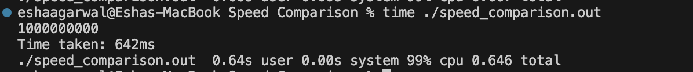
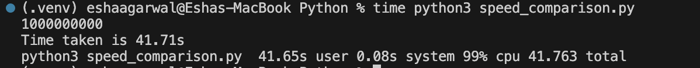

# RESULTS of Speed Comparison

### Task of counting to 1,000,000,000 in both c++ and python [video](https://www.youtube.com/watch?v=VioxsWYzoJk)

#### Time taken in C++ **642ms** [code](../C++/Speed%20Comparison/speed_comparison.cpp)

#### Time taken in Python **41.71s** [code](../Python/speed_comparison.py)

